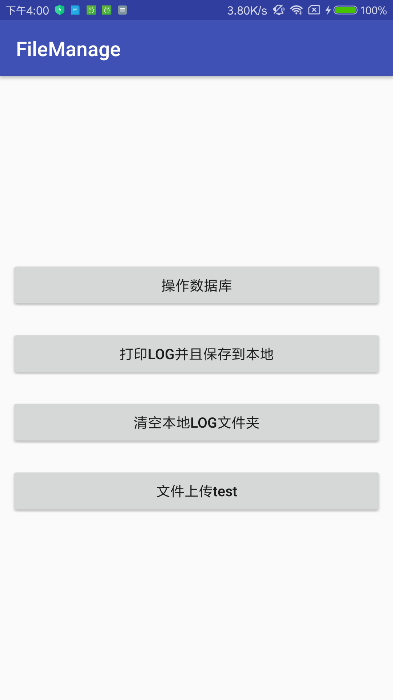
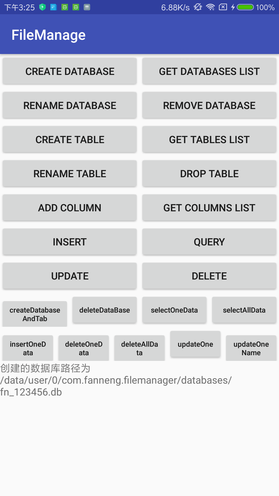

#### 添加依赖和配置

* 工程添加依赖仓库，Add the JitPack repository to your build file

```Java
allprojects {
   repositories {
   		 maven { url "http://maven.aliyun.com/nexus/content/groups/public/" }
         maven { url "http://maven.aliyun.com/nexus/content/repositories/jcenter" }
         maven { url "https://jitpack.io" }
         google()
         jcenter()
         mavenCentral()
   }
}
```

* APP目录build.gradle文件添加如下配置：

```Java
dependencies {
   implementation 'com.github.liujianguangnice:FNFileManager:1.0.0'
}
```


#### 2、效果展示





#### 3、核心代码

* BaseApplication添加如下配置：

```Java
public class BaseApplication extends Application {


    private static DaoSession daoSession;
    private static String  DbName = "FanNeng.db";
    /**
     * DEBUG 模式
     * 注意！请不要在正式发布的 App 中使用 Debug 模式！
     */
    private static BaseApplication application = null;


    public static BaseApplication getApplication() {
        return application;
    }
    @Override
    public void onCreate() {
        super.onCreate();
        application = this;

        //配置数据库
        setupDatabase(DbName);

        //配置文件存储和上传类
        setupFileManager();
    }

    private void setupFileManager() {
        //在本地存储信息
        FileInfoReport.getInstance()
                .setCacheSize(30 * 1024 * 1024)//支持设置缓存大小，超出后清空
                .setSaveFileInfoDir(getApplicationContext())
                .setWifiOnly(true)//设置只在Wifi状态下上传，设置为false为Wifi和移动网络都上传
                .setFileSaver(new FilesWriter(getApplicationContext()))//支持自定义保存信息的样式
                //.setEncryption(new AESEncode()) //支持文件数据AES加密或者DES加密，默认不开启
                .init(getApplicationContext());

        //initHttpReporter();
    }

    /**
     * 使用HTTP发送日志
     */
    private void initHttpReporter() {
        HttpReporter http = new HttpReporter(this);
        http.setUrl("http://10.4.94.166:8080");//发送请求的地址
        http.setFileParam("fileName");//文件的参数名
        http.setToParam("to");//收件人参数名
        http.setTo("你的接收邮箱");//收件人
        http.setTitleParam("标题");//标题
        http.setBodyParam("内容");//内容
        FileInfoReport.getInstance().setUploadType(http);
    }


    /**
     * 配置数据库
     */
    private void setupDatabase(String DbName) {
        //创建数据库shop.db"
        DaoMaster.DevOpenHelper helper = new DaoMaster.DevOpenHelper(this, DbName, null);
        //获取可写数据库
        SQLiteDatabase db = helper.getWritableDatabase();
        //获取数据库对象
        DaoMaster daoMaster = new DaoMaster(db);
        //获取Dao对象管理者
        daoSession = daoMaster.newSession();


        /*DevOpenHelper：创建SQLite数据库的SQLiteOpenHelper的具体实现
        DaoMaster：GreenDao的顶级对象，作为数据库对象、用于创建表和删除表
        DaoSession：管理所有的Dao对象，Dao对象中存在着增删改查等API*/
    }

    public static DaoSession getDaoInstant() {
        return daoSession;
    }
}


```
* BaseApplication添加如下配置：

```Java
  //写文件
  FileInfoWriter.writeFileInfo(TAG, "文件文本信息！！！！");
  //删除文件
  FileUtil.deleteDir(new File(FileInfoReport.getInstance().getROOT()));

```
